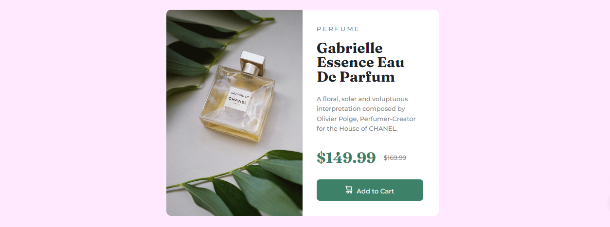

<h1>Responsive Perfume Card: Media Query Practice</h1>

## Project Overview

This project is a responsive perfume card created to practice and master the use of media queries. The design adjusts seamlessly between desktop and mobile views, ensuring a consistent and visually appealing experience across different devices.

### 🖥️ Desktop Version

- The card is structured with a grid layout, featuring two columns: an image on the left and text on the right.
- The dimensions are fixed, providing a clean and centered appearance.

### 📱 Mobile Version

- The layout switches to a single-column design.
- The image appears on top, with text content stacked below, ensuring optimal readability on smaller screens.

---

## 🚀 Technologies Used

---

## 📝 Conclusion

This project was a great way to reinforce the use of media queries and responsive design principles. The final result is a sleek, adaptive card that performs well on various screen sizes.

---

